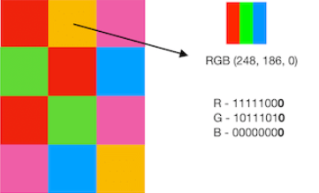
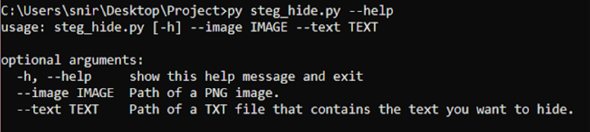

<h1 align="center">Image Steganography</h1>
<h2 align="center">Background</h2>

Steganography is a method of hiding information within a file, message, image, or video. This project involves both hiding text inside an image and finding hidden text within an image. (Supported file type: PNG)

---

- [Installation 💻](#installation-)
- [Usage 🖱️](#usage-️)
- [How it works | Hide Stage 👨‍💻](#how-it-works--hide-stage-)
- [How it works | Decode Stage 🕵️‍♂️](#how-it-works--decode-stage-%EF%B8%8F%EF%B8%8F)

---

## Installation 💻

1. Ensure Python 3.x is installed on your system.
2. Clone the repository to your local machine.
3. Install all required Python packages by running the following command in the terminal:

```bash
pip install -r .\requirements.txt
```


## Usage 🖱️

To hide text inside an image, run the following command in the terminal:

```bash
py steg_hide.py --image <IMAGE_PATH> --text <TEXT_FILE_PATH>
```

To find an hidden text inside an image, run the following command in the terminal:

```bash
py steg_decode.py --image <IMAGE_PATH>
```


## How it works | Hide Stage 👨‍💻
In this stage, we hide text inside a PNG image.
How is the text hidden? Before answering that, let's take a moment for a brief explanation:
An image consists of many pixels. Each pixel is made up of three 8-bit bytes (values ranging from 0 to 255), called RGB (Red, Green, Blue). These three bytes represent the intensity of each color in a single pixel. Thus, the color of the pixel is a combination of red, green, and blue with varying intensities.
<p align="center">
  
</p>

So where do we hide the text? As we mentioned, an image consists of pixels, and each pixel is composed of three colors. Each color is represented by a byte consisting of 8 bits. The intensity of each color is represented in binary. We hide the text in the least significant bits (LSB) of each byte.
How do you do it? Every letter in the English language (as well as other characters, such as spaces and punctuation marks) has a different ASCII representation. For example, the letter H has the ASCII value 72, which is 01001000 in binary.
Hiding the text in the image involves going through all the bits in the binary representation of the ASCII value of the letter and embedding them in the least significant bits (LSB) of each byte in the image. For instance, if the ASCII value of the letter H is 72, or 01001000 in binary, the process would be as follows:
0->1->0->0->1->0->0->0 
Each time we place a bit in the least significant bit (LSB) of the next byte in the image. We continue this process until all the characters in the text we want to hide have been processed.
My implementation is expressed in a function that first checks the validity of the input and then proceeds with a nested loop that replaces the appropriate bits. The function looks like this:
```python
def hide(image_path: str, text_to_hide: str) -> str:
   """
   This is the main logic function of hiding text in LSB channel of an image.
   It converts the text to a list of uint-8 ascii representation of each letter,
   and then hides the text in the Least Significant Bits of the image and saves it.
   """
   image_as_np_array = utils.png_file_to_rgb_np_array_converter(image_path)
   if image_as_np_array.size < len(text_to_hide) * 8:
       raise ValueError("The given text is too long for the given image.\n"
                        "Try a shorter text, or a bigger image.")
   ascii_values_of_chars = [ord(char) for char in text_to_hide]
   bits_to_hide = ''.join([f'{val:0{NUM_OF_BITS_IN_ASCII_SYMBOL}b}' for val in ascii_values_of_chars])
   for line_num, line in enumerate(image_as_np_array):
       for column_num, column in enumerate(line):
           # looping over all RGB values in image
           rgb_value = image_as_np_array[line_num][column_num]
           for color_index, color_value in enumerate(rgb_value):
               if bits_to_hide == '':
                   new_name = utils.get_output_path(image_path, utils.Stage.HIDE)
                   utils.np_array_to_png_file_converter(np.array(image_as_np_array), new_name)
                   return new_name
               bit_to_hide = bits_to_hide[0]
               bits_to_hide = bits_to_hide[1:]
               image_as_np_array[line_num][column_num][color_index] = utils.set_bit(
                   image_as_np_array[line_num][column_num][color_index], int(bit_to_hide), 0)
   raise Exception("Unexpected error occurred.")
```
Finally, after we have finished hiding all the bits, and the image now contains the hidden text, the image is saved in a path with the same name, but with the addition of "_hidden" and the PNG extension.

To run the software, you will need to provide parameters for an image file and a text file:
<p align="center">
  
</p>

Let’s provide it the example files:

```bash
py .\steg_hide.py --image .\example_files\example_image.png --text .\example_files\example_text.txt
```

The run was successful. Below are the two images, and the text file:

<p align="center">
  
</p>
On the left is the original image, and on the right is the image with the hidden text: "Imagine there is no heaven! It is easy if you try. No hell below us. Above us, only sky (The Beatles)." As you can see, the change is not visible. Later, during the decode stage, we will find the hidden text by running steg_decode.py with the image on the right as a parameter.

## How it works | Decode Stage 🕵️‍♂️
test
