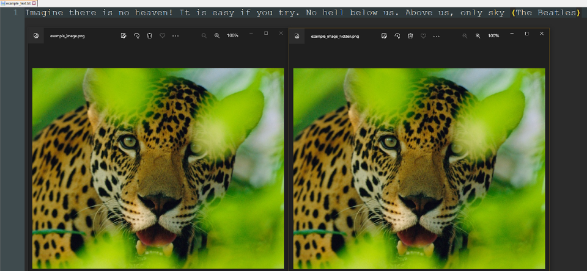

<h1 align="center">Image Steganography</h1>
<h2 align="center">Background</h2>

Steganography is a method of hiding information within a file, message, image, or video. This project involves both hiding text inside an image and finding hidden text within an image. (Supported file type: PNG)

---
- [Installation 💻](#installation-)
- [Usage 🖱️](#usage-️)
- [How it works | Hide Stage 👨‍💻](#how-it-works--hide-stage-)
- [How it works | Decode Stage 🕵️‍♂️](#how-it-works--decode-stage-%EF%B8%8F%EF%B8%8F)
---

## Installation 💻
1. Ensure Python 3.x is installed on your system.
2. Clone the repository to your local machine.
3. Install all required Python packages by running the following command in the terminal:
```bash
pip install -r .\requirements.txt
```

## Usage 🖱️
To hide text inside an image, run the following command in the terminal:
```bash
py steg_hide.py --image <IMAGE_PATH> --text <TEXT_FILE_PATH>
```

To find hidden text inside an image, run the following command in the terminal:
```bash
py steg_decode.py --image <IMAGE_PATH>
```

## How it works | Hide Stage 👨‍💻
In this stage, we hide text inside a PNG image.
How is the text hidden? Before answering that, let's take a moment for a brief explanation:
An image consists of many pixels. Each pixel is made up of three 8-bit bytes (values ranging from 0 to 255), called RGB (Red, Green, Blue). These three bytes represent the intensity of each color in a single pixel. Thus, the color of the pixel is a combination of red, green, and blue with varying intensities.

<p align="center">
  
</p>

So where do we hide the text? As we mentioned, an image consists of pixels, and each pixel is composed of three colors. Each color is represented by a byte consisting of 8 bits. The intensity of each color is represented in binary. We hide the text in the least significant bits (LSB) of each byte.
How do you do it? Every letter in the English language (as well as other characters, such as spaces and punctuation marks) has a different ASCII representation. For example, the letter H has the ASCII value 72, which is 01001000 in binary.

Hiding the text in the image involves going through all the bits in the binary representation of the ASCII value of the letter and embedding them in the least significant bits (LSB) of each byte in the image. For instance, if the ASCII value of the letter H is 72, or 01001000 in binary, the process would be as follows:
0->1->0->0->1->0->0->0 
Each time we place a bit in the least significant bit (LSB) of the next byte in the image. We continue this process until all the characters in the text we want to hide have been processed.
My implementation is expressed in a function that first checks the validity of the input and then proceeds with a nested loop that replaces the appropriate bits. The function looks like this:
```python
def hide(image_path: str, text_to_hide: str) -> str:
   """
   This is the main logic function of hiding text in LSB channel of an image.
   It converts the text to a list of uint-8 ascii representation of each letter,
   and then hides the text in the Least Significant Bits of the image and saves it.
   """
   image_as_np_array = utils.png_file_to_rgb_np_array_converter(image_path)
   if image_as_np_array.size < len(text_to_hide) * 8:
       raise ValueError("The given text is too long for the given image.\n"
                        "Try a shorter text, or a bigger image.")
   ascii_values_of_chars = [ord(char) for char in text_to_hide]
   bits_to_hide = ''.join([f'{val:0{NUM_OF_BITS_IN_ASCII_SYMBOL}b}' for val in ascii_values_of_chars])
   for line_num, line in enumerate(image_as_np_array):
       for column_num, column in enumerate(line):
           # looping over all RGB values in image
           rgb_value = image_as_np_array[line_num][column_num]
           for color_index, color_value in enumerate(rgb_value):
               if bits_to_hide == '':
                   new_name = utils.get_output_path(image_path, utils.Stage.HIDE)
                   utils.np_array_to_png_file_converter(np.array(image_as_np_array), new_name)
                   return new_name
               bit_to_hide = bits_to_hide[0]
               bits_to_hide = bits_to_hide[1:]
               image_as_np_array[line_num][column_num][color_index] = utils.set_bit(
                   image_as_np_array[line_num][column_num][color_index], int(bit_to_hide), 0)
   raise Exception("Unexpected error occurred.")
```

Finally, after we have finished hiding all the bits, and the image now contains the hidden text, the image is saved in a path with the same name, but with the addition of "_hidden" and the PNG extension.

To run the software, you will need to provide parameters for an image file and a text file:
<p align="center">
  
</p>

Let’s provide the example files:
```bash
py .\steg_hide.py --image .\example_files\example_image.png --text .\example_files\example_text.txt
```

The run was successful. Below are the two images, and the text file:
<p align="center">
  
</p>
On the left is the original image, and on the right is the image with the hidden text: "Imagine there is no heaven! It is easy if you try. No hell below us. Above us, only sky (The Beatles)." As you can see, the change is not visible. Later, during the decode stage, we will find the hidden text by running steg_decode.py with the image on the right as a parameter.

## How it works | Decode Stage 🕵️‍♂️
In this stage, we find hidden text within a PNG image, but the process is now quite a bit more complicated.

The text is not necessarily hidden only in the least significant bits of each pixel but can be hidden in each of the three least significant bits (which I will refer to as channels LSB_0, LSB_1, and LSB_2). Each word in the sentence can be located in a different 'LSB channel,' but each hidden word must start and end in the same LSB channel. However, different words may be placed in any of the three LSB channels.
Additionally, you do not necessarily start hiding the sentence at the beginning of the image; you can begin embedding the text at any pixel in the image.
Let's jump to the explanation. But just before we do, let's check that the implementation actually works by finding the hidden text within the image we created in the previous part:


<p align="center">
  
</p>

And indeed, we have the correct text! Now that we are convinced that the hiding and decoding work, we will move on to the fun part: the implementation.
The implementation was quite lengthy, so I will cover the main and important sections here.

Everything starts with the main function, decode:
```python
def decode(image_as_np_array: np.ndarray) -> str:
   """
   This is the main logic function of decoding an image with hidden text in it.
   It tries to find the best guess as if the text was hidden start from each byte in the image.
   """
   max_words = 0
   best_guess = ''
   for i in range(8):
       symbols_of_channels = get_hidden_ascii_symbols_of_channels_from_image_as_np_array(image_as_np_array, i)
       guess = guess_hidden_text(symbols_of_channels)
       if len(guess.split(SPACE)) > max_words:
           max_words = len(guess.split(SPACE))
           best_guess = guess
   return best_guess
```

This function generates a list of symbols (ASCII characters) from the three LSB channels each time it is called. It then sends these symbols to the guess_hidden_text function, which provides its best guess for the hidden text.

In the end, the longest sentence found will be returned as our best guess, which we will print and save to a file.

There is a loop of 8 iterations to check all possible starting positions of the hidden sentence. Each time, the function get_hidden_ascii_symbols_of_channels_from_image_as_np_array is provided with a certain offset, between 0 and 7, from which we begin the process of extracting the symbols.

```python
def get_hidden_ascii_symbols_of_channels_from_image_as_np_array(image_as_np_array: np.ndarray, start_index) -> [[str]]:
   """
   This function creates and returns a list of all hidden ascii symbols were hidden in the image,
   in all relevant LSB channels.
   """
   image_as_np_array = image_as_np_array.flatten()
   image_as_np_array = image_as_np_array[start_index:]

   # To make the array divisible by NUM_OF_BITS_IN_ASCII_SYMBOL
   num_of_colors_to_ignore_at_the_end = image_as_np_array.size % config.NUM_OF_BITS_IN_ASCII_SYMBOL
   if num_of_colors_to_ignore_at_the_end:
       image_as_np_array = image_as_np_array[:-num_of_colors_to_ignore_at_the_end]

   hidden_ascii_symbols_of_channels = [copy.deepcopy(image_as_np_array) for _ in range(MAX_HIDE_CHANNELS)]

   for i in range(MAX_HIDE_CHANNELS):
       # Get the LSB-i of each color (byte) in the image
       mask = utils.set_bit_1(0, i)
       hidden_ascii_symbols_of_channels[i] = (hidden_ascii_symbols_of_channels[i] & mask)
       # Combine each 8 bits to a uint-8
       hidden_ascii_symbols_of_channels[i] = np.packbits(hidden_ascii_symbols_of_channels[i])
       # Convert each uint-8 to its ascii representation (string)
       hidden_ascii_symbols_of_channels[i] = list(map(chr, hidden_ascii_symbols_of_channels[i]))

   return hidden_ascii_symbols_of_channels
```

The symbol extraction process uses a library called NumPy, which helps with matrix operations, as seen here.
Essentially, what happens is that I create different masks for each LSB channel and extract the appropriate bits using bitwise operations. Then, every 8 bits are converted into a byte in a numeric representation, and finally, each numeric value is converted to the corresponding ASCII character.
Hooray!
Now that we have all the symbols, some of which may be the hidden ones, we proceed to the next step: guessing the hidden text.

```python
def guess_hidden_text(symbols_of_channels: [[str]]) -> str:
   """
   This function calculates and returns the longest sentence that was hidden in all relevant LSB channels.
   """
   valid_text_channels = [[]] * len(symbols_of_channels)

   for i in range(len(valid_text_channels)):
       valid_text_channels[i] = get_valid_symbol_combinations_of_channel(symbols_of_channels[i])
       valid_text_channels[i] = remove_non_valid_one_letter_words(valid_text_channels[i])
       valid_text_channels[i] = remove_non_english_words(valid_text_channels[i])
       valid_text_channels[i] = add_punctuations_if_exists(valid_text_channels[i], symbols_of_channels[i])

   all_texts = [text for valid_text_channel in valid_text_channels for text in valid_text_channel]
   all_texts.sort(key=lambda t: t.start_index)

   hidden_text = longest_sentence(all_texts)
   return hidden_text
```

We start with three LSB channels that contain symbols. We use elimination to eliminate as much unrelated data as possible for each channel. The steps are:

We filter out characters that are not ASCII. At the end of this step, we are left with an array of readable character sequences (including letters, spaces, and punctuation marks). For each sequence, I also save a start_index that indicates the position of the first character of the sequence among the characters in the corresponding LSB channel.
Filter out words that are only one letter long, except for spaces, "i", or "a" (these are the only characters that can stand alone).
Filter out words that are not English words. I will provide further details later.
Add punctuation marks to words if there were hidden punctuation marks next to the words.

Finally, when there are sequences of logical words with punctuation and spaces in the three different channels, we combine all the channels into one list and sort it according to the start_index of each word.

Once we have this merged list, we scan through it to find the longest sequence (sentence). This process is handled by the longest_sentence function, which I will explain in detail later. But first, I will explain how I filtered out the words that are not in the English language:

```python
def remove_non_english_words(words: [Text]) -> [Text]:
   """
   This function filters out from the given list all the words that are not
   common words in English according to the dictionary in the config.py file.
   """
   filtered_words = []

   for word in words:
       if word.text == SPACE:
           filtered_words.append(word)

       english_word = probably_english_word(word)

       if english_word:
           # Capital letters can be only at the start of a word
           word_is_valid = True
           for letter in english_word.text[1:]:
               if letter in VALID_UPPERCASE_LETTERS:
                   word_is_valid = False
                   break
           if word_is_valid:
               filtered_words.append(english_word)

   return filtered_words
```

```python
def probably_english_word(word: Text) -> Text or None:
   """
   Notice - our MOST_COMMON_ENGLISH_WORDS list is lowercase.
   :param word: Combination of readable symbols with text which is not '' and not  ' '.
   :return: What is most likely to be the word in english of the given text, or None if nothing was found.
   """
   text = word.text
   text_lower = text.lower()
   start_index = word.start_index

   if text_lower in config.MOST_COMMON_ENGLISH_WORDS_LOWERCASE:
       return word

   for word in config.MOST_COMMON_ENGLISH_WORDS_LOWERCASE:
       if word == text_lower:
           return word
       if word in text_lower:
           if len(text_lower) - len(word) <= 1:
               if text_lower[1:] == word:
                   return Text(start_index + 1, text[1:])
               return Text(start_index, text[:-1])
   return None
```

We come to these functions equipped with a list of the most common English words in lowercase (from now on, I will refer to this list as our dictionary).

First, we check if there is a perfect match between our word and any word in the dictionary. If so, great - we'll keep our word.

If there is no match, the word may still be worth keeping. For example, "hellox" or "xhello" is not an English word, but it is possible that a real English word might have had an extra letter like "x" added by chance before or after it. I check the word, and if it is indeed valid, I keep it and update its text and start_index if necessary.

One final check before returning the list of English words is to verify the usage of lowercase and uppercase letters. English words can start with a capital letter, but capital letters should not appear in the middle of a word, so I remove such cases.

Now we have all the English words in our hands! We performed this process for each of the three LSB channels. After combining the channels into one long list, it's time to determine the longest sentence and return it.

```python
def longest_sentence(all_words: [Text]) -> str:
   """
   This function calculate and returns the longest sentence in English that
   was hidden in the image.
   """
   max_strike_len = 0
   longest_strike = []

   for i in range(len(all_words)):
       current_longest_strike = longest_sentence_from_word(i, all_words)
       current_strike_len = len(current_longest_strike)
       if current_strike_len > max_strike_len:
           max_strike_len = current_strike_len
           longest_strike = copy.deepcopy(current_longest_strike)

   return ''.join([word.text for word in longest_strike])
```

We go through all the words and send each one to a function that begins checking for the longest logical sequence starting from that word.

Finally, we declare the longest sentence to be the longest sequence found from all possible sequence tests and return it.

To determine the longest logical sequence starting from a certain word, we use a relatively simple recursive function:

```python
# noinspection PyTypeChecker
def longest_sentence_from_word(i: int, all_words: [Text], should_be_space=False) -> [Text]:
   """
   This recursive function, returns the longest strike of words and spaces starting from a specific word.

   It looks at the start_index of the words, and based on the size of the word,
   calculates the index where the next word should be.

   Also, a check is made that after every English word there is a space,
   and after every space there is an English word (so that we get a proper sentence)
   """
   current_word = all_words[i]

   if all_words[i].text == SPACE and not should_be_space:
       return []
   if all_words[i].text != SPACE and should_be_space:
       return []

   # Because we combined 3 hidden channels (of 3 LSBs) we may have up to 3 options to continue the strike
   possible_options_to_continue = []
   next_start_index_should_be = all_words[i].start_index + len(all_words[i].text)

   for j in range(i + 1, len(all_words)):
       if all_words[j].start_index < next_start_index_should_be:
           continue
       if all_words[j].start_index > next_start_index_should_be:
           break
       possible_options_to_continue.append(j)

   possible_strikes = [longest_sentence_from_word(j, all_words, not should_be_space) for j in
                       possible_options_to_continue]

   return [current_word] if possible_strikes == [] else [current_word] + max(possible_strikes, key=len)
```

This function examines the start_index of each word and, based on the size of the word, calculates the index where the next word should appear. It also ensures that there is a space after every English word and that there is an English word following every space, so that we form proper sentences.

With this, we have completed the review of the software's logic!

